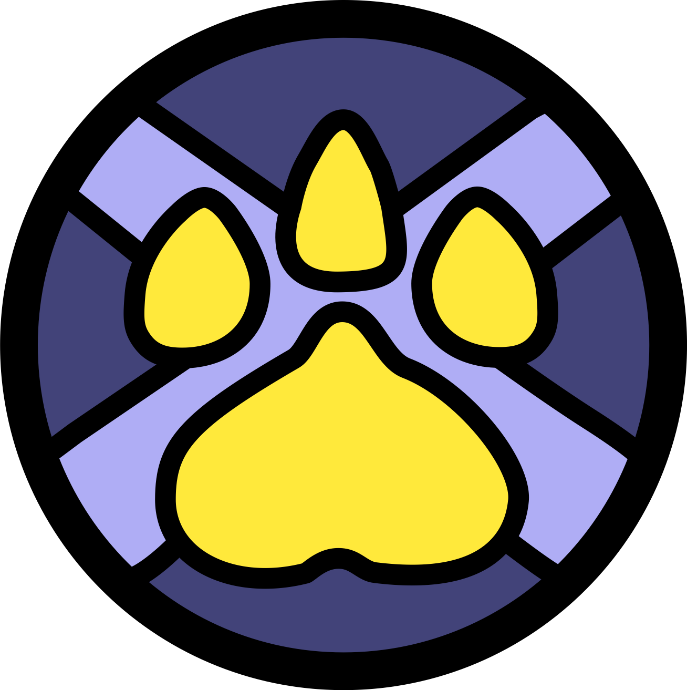

  
  <h2 style="font-family: Cursive; font-size: 50px; color: #c8c2ff; display: inline-block; vertical-align: middle; margin-left: 10px;">Furry Crossroads</h2>

<i>A Community Driven on Putting our Members First</i>

  
  
  

<b>Follow Furry Crossroads! </b>

  
  
  

<b>Connect with the Creator </b>

  <a href="https://twitter.com/ishaanbhola" target="blank">
    
  </a>

Welcome to the FurryCrossroadsAPI! This is an open-source and secure way to interact with the Furry Crossroads universe. Now in version 2.0, our API integrates a secure token-based authentication and comprehensive logging system.

This setup allows for easy generation and authentication of new tokens, facilitating different Furry Crossroads applications to make the most out of the functionalities offered by our API. As we continue to innovate, you can look forward to more features and diverse ways of interacting with the Furry Crossroads ecosystem in the future versions.

## Setup

To set up the FurryCrossroadsAPI, you need to follow these steps:

1. **Clone or Fork**: Start by cloning this repository or fork it if you wish to customize the API, and then clone your fork.

2. **Create a Virtual Environment**: Once you've cloned the repository, create a virtual environment on your operating system.

3. **Set Environment Variables**: The API authenticates with the server through certain environment variables. You need to set these variables in your environment:

    - `FCAPI`: This is a mandatory variable, and its absence will result in a runtime error.
    - `FCAPI_SQLALCHEMY_USERNAME`: This represents the SQLAlchemy username.
    - `FCAPI_SQLALCHEMY_PASSWORD`: This represents the SQLAlchemy password.
    - `FCAPI_SQLALCHEMY_HOST`: This defines the SQLAlchemy host.
    - `FCAPI_SQLALCHEMY_DATABASE_NAME`: This defines the SQLAlchemy database name.
    - `FCAPI_SQLALCHEMY_DATABASE_TYPE`: This defines the SQLAlchemy database type. Note that FurryCrossroadsAPI was built assuming PostgreSQL as the database type. Compatibility with other types may vary.

4. **Install the requirements**: Once your environment is set up, you can install the required packages using the requirements.txt file.

## Community

Furry Crossroads isn't just about the API. We're a community of enthusiasts, developers, and contributors who make this project possible. You're welcome to join us. Click on the Discord badge above to get started!

